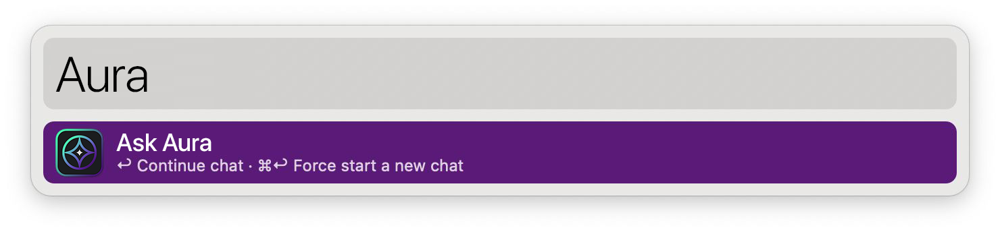
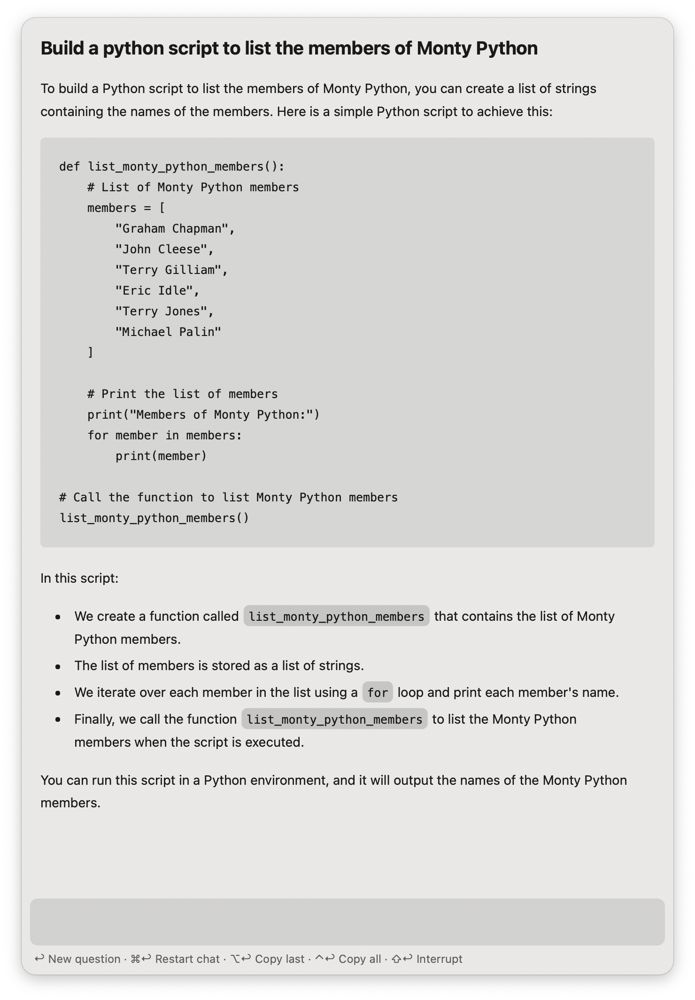

### This is a forked version from <a href="https://github.com/alfredapp/openai-workflow">@alfredapp/openai-workflow</a> adapted for Orion Aura Model

#  Aura Alfred Workflow

Aura integrations

## Setup
TO-DO

## Usage
Query Aura via the `aura` keyword.

* <kbd>↩&#xFE0E;</kbd> Ask a new question.
* <kbd>⌘</kbd><kbd>↩&#xFE0E;</kbd> Clear and restart chat.
* <kbd>⌥</kbd><kbd>↩&#xFE0E;</kbd> Copy last answer.
* <kbd>⌃</kbd><kbd>↩&#xFE0E;</kbd> Copy full chat.
* <kbd>⇧</kbd><kbd>↩&#xFE0E;</kbd> Stop generating answer.
